# ER Diagram — Education Management System

สร้างจาก `prisma/schema.prisma` (MySQL). แสดงทุกตารางและความสัมพันธ์
เปิดไฟล์นี้ใน VS Code (Markdown Preview) หรือ GitHub เพื่อดูภาพ Mermaid

```mermaid
erDiagram
    users {
        int          user_id PK
        varchar      email UK
        varchar      password_hash
        enum         role "student|teacher|admin"
        varchar      first_name
        varchar      last_name
        varchar      phone
        varchar      address
        varchar      avatar_url
        bool         is_active
        enum         approval_status "pending|approved|rejected"
        datetime     approved_at
        int          approved_by
        datetime     created_at
        datetime     updated_at
    }

    otp_verifications {
        int      otp_id PK
        int      user_id FK
        varchar  otp_code
        enum     purpose "reset_password|register"
        datetime expires_at
        bool     is_used
        datetime created_at
    }

    faculties {
        int     faculty_id PK
        varchar faculty_name
        varchar faculty_code UK
    }

    departments {
        int     department_id PK
        int     faculty_id FK
        varchar department_name
        varchar department_code UK
    }

    students {
        int   student_id PK
        int   user_id FK,UK
        varchar student_code UK
        int   department_id FK
        int   admission_year
        enum  status "active|graduated|suspended|retired"
        int   advisor_id FK
        json  custom_semesters
    }

    teachers {
        int     teacher_id PK
        int     user_id FK,UK
        varchar teacher_code UK
        int     department_id FK
        varchar position
        varchar office_room
        varchar specialization
    }

    curriculums {
        int      curriculum_id PK
        varchar  curriculum_name
        int      department_id FK
        int      year
        int      total_credits
        enum     status "active|inactive"
        datetime created_at
    }

    courses {
        int     course_id PK
        varchar course_code UK
        varchar course_name
        int     credits
        enum    course_type "required|elective|general"
        int     department_id FK
        int     coordinator_id FK
        text    description
    }

    course_prerequisites {
        int id PK
        int course_id FK
        int prerequisite_id FK
    }

    curriculum_courses {
        int curriculum_id FK
        int course_id FK
        int semester
        int year_level
    }

    semesters {
        int      semester_id PK
        varchar  semester_name
        int      academic_year
        int      semester_number
        date     start_date
        date     end_date
        bool     is_current
        datetime reg_open_date
        datetime reg_close_date
    }

    course_sections {
        int     section_id PK
        int     course_id FK
        int     semester_id FK
        varchar section_number
        int     teacher_id FK
        int     max_students
        int     current_students
    }

    schedules {
        int     schedule_id PK
        int     section_id FK
        enum    day_of_week "MON..SUN"
        time    start_time
        time    end_time
        varchar room
        varchar building
    }

    enrollments {
        int      enrollment_id PK
        int      student_id FK
        int      section_id FK
        enum     status "enrolled|completed|dropped|withdrawn|pending"
        varchar  grade
        int      attendance_score
        int      assignment_score
        int      midterm_score
        int      final_score
        datetime enrolled_at
    }

    course_plans {
        int  plan_id PK
        int  student_id FK
        int  course_id FK
        int  planned_semester
        int  planned_year
        enum status "planned|completed|skipped"
    }

    makeup_classes {
        int      makeup_id PK
        int      section_id FK
        date     original_date
        date     makeup_date
        time     start_time
        time     end_time
        varchar  room
        text     reason
        enum     status "scheduled|completed|cancelled"
        int      created_by FK
        datetime created_at
    }

    announcements {
        int      announcement_id PK
        varchar  title
        text     content
        enum     target_role "all|student|teacher"
        int      section_id FK
        bool     is_pinned
        varchar  status
        int      created_by FK
        datetime created_at
        datetime updated_at
    }

    notifications {
        int      notification_id PK
        int      user_id FK
        varchar  title
        text     message
        enum     type "schedule|enrollment|announcement|makeup|system"
        bool     is_read
        datetime created_at
    }

    import_logs {
        int      import_id PK
        int      imported_by FK
        varchar  file_name
        enum     import_type "students|courses|enrollments|teachers"
        int      total_rows
        int      success_rows
        int      created_rows
        int      updated_rows
        int      error_rows
        enum     status "processing|completed|failed"
        datetime created_at
    }

    %% ---------- Relationships ----------
    users ||--o| students          : "is"
    users ||--o| teachers           : "is"
    users ||--o{ otp_verifications  : "has"
    users ||--o{ announcements      : "authors"
    users ||--o{ notifications      : "receives"
    users ||--o{ import_logs        : "runs"

    faculties   ||--o{ departments  : "has"
    departments ||--o{ students     : "enrolls"
    departments ||--o{ teachers     : "employs"
    departments ||--o{ curriculums  : "offers"
    departments ||--o{ courses      : "owns"

    teachers ||--o{ students        : "advises"
    teachers ||--o{ courses         : "coordinates"
    teachers ||--o{ course_sections : "teaches"
    teachers ||--o{ makeup_classes  : "creates"

    curriculums ||--o{ curriculum_courses : "contains"
    courses     ||--o{ curriculum_courses : "listed_in"

    courses ||--o{ course_prerequisites : "requires"
    courses ||--o{ course_prerequisites : "is_prereq_of"

    courses   ||--o{ course_sections : "opened_as"
    semesters ||--o{ course_sections : "scheduled_in"

    course_sections ||--o{ schedules      : "meets_at"
    course_sections ||--o{ enrollments    : "has"
    course_sections ||--o{ makeup_classes : "reschedules"
    course_sections ||--o{ announcements  : "posts"

    students ||--o{ enrollments  : "makes"
    students ||--o{ course_plans : "plans"
    courses  ||--o{ course_plans : "planned_in"
```

## หมายเหตุความสัมพันธ์สำคัญ

| ความสัมพันธ์ | ชนิด | อธิบาย |
|---|---|---|
| `users` ↔ `students` / `teachers` | 1:1 (optional) | หนึ่ง user เป็นได้แค่ student หรือ teacher (หรือ admin ที่ไม่มีทั้งคู่) |
| `teachers` → `students` (advisor) | 1:N | อาจารย์ที่ปรึกษา (self-ref ผ่าน `advisor_id`) |
| `courses` ↔ `courses` (prerequisite) | M:N | ผ่านตารางเชื่อม `course_prerequisites` |
| `curriculums` ↔ `courses` | M:N | ผ่าน `curriculum_courses` |
| `students` ↔ `course_sections` | M:N | ผ่าน `enrollments` (มีเกรด/คะแนน) |
| `course_sections` | ศูนย์กลาง | เชื่อม course + semester + teacher และมี schedule/enrollment/makeup/announcement |

Cascade delete มีที่: `otp_verifications`, `students`, `teachers`, `schedules`, `announcements`, `notifications` (เมื่อลบ parent)
